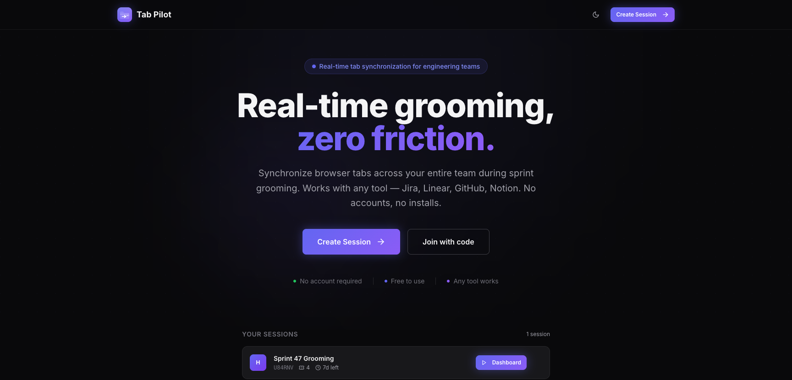
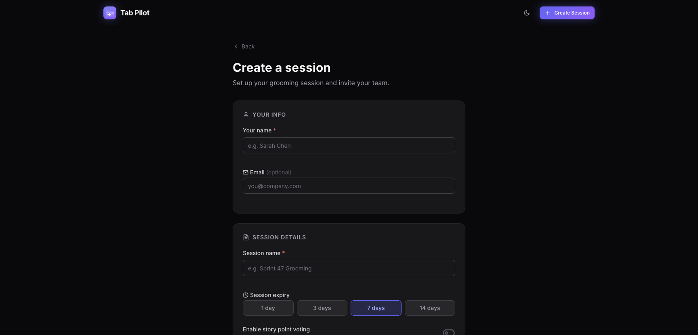
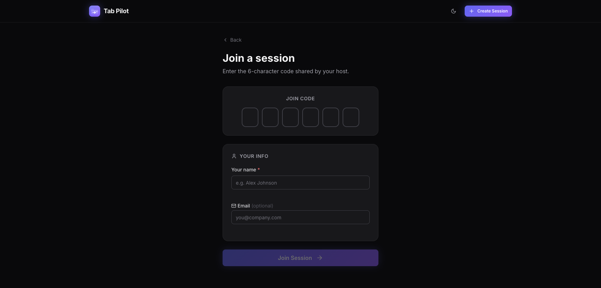
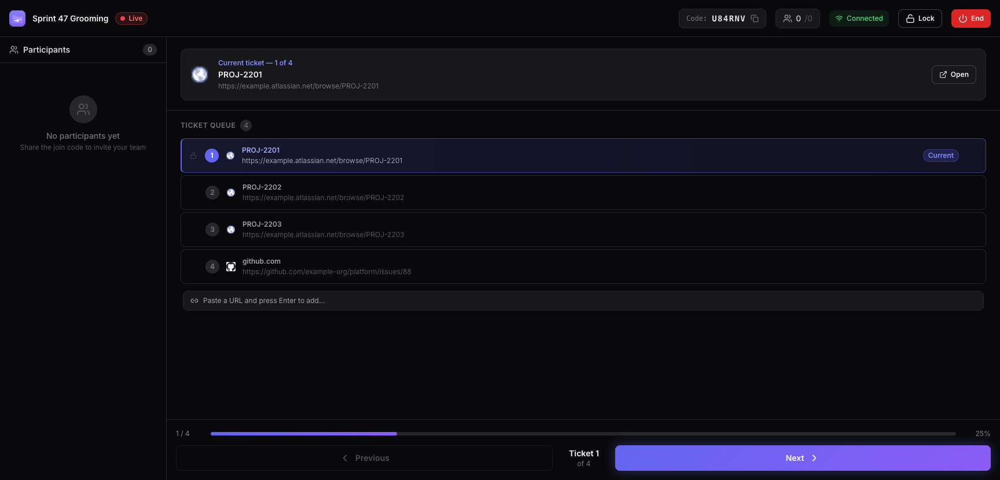
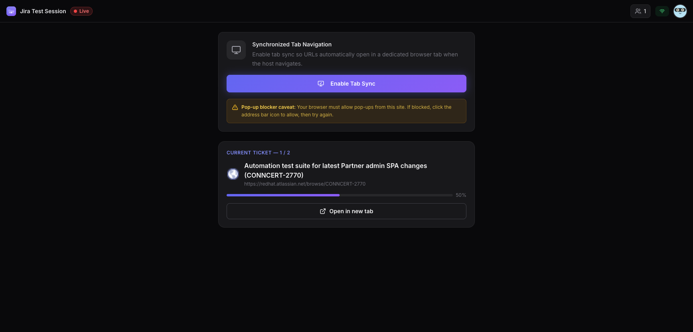

<div align="center">


# Tab Pilot

**Real-time tab synchronization for engineering grooming sessions**

*The host navigates. Everyone follows. No installs, no accounts, no friction.*

[](https://github.com/gautamkrishnar/TabPilot/actions/workflows/ci.yml)
[](https://www.gnu.org/licenses/gpl-3.0)
[](https://nodejs.org/)
[](https://github.com/gautamkrishnar/TabPilot/pkgs/container/tabpilot)

</div>

## What is Tab Pilot?

Remote grooming sessions waste minutes on "which ticket are we on?". Tab Pilot fixes that.

The facilitator creates a session, pastes a list of ticket URLs, and shares a 6-character join code. When they click **Next**, every participant's browser automatically opens the correct ticket — no copy-pasting links, no confusion, no lag.

It works with any ticketing tool that has a URL: **Jira, Linear, GitHub Issues, Notion, Confluence, Shortcut, ClickUp**, or anything else.

## Features

- 🔗 **Real-time tab sync** — when the host navigates, every participant follows instantly
- 🎟️ **6-character join codes** — share in Slack, Teams, or a meeting chat in seconds
- 👤 **Zero-friction joining** — just a name, no accounts or installs required
- 🌐 **Works with any tool** — any `http/https` URL is supported
- 🔒 **Session locking** — stop new participants from joining mid-session
- 🚫 **Kick participants** — remove someone from an active session
- 🗳️ **Story point voting** — optional estimation with simultaneous reveal
- 🎫 **Live queue management** — add, remove, and reorder tickets during a session
- 🏷️ **Jira title enrichment** — Jira URLs automatically show their issue summary
- 💾 **Session memory** — previously joined sessions appear on the home screen for one-click resume
- 🌓 **Dark / light mode** — system preference by default, with a manual toggle

## Get Started

### Run with Podman

```bash
podman compose up -d
open http://localhost:3000
```

### Run locally (for development)

See **[docs/DEVELOPMENT.md](docs/DEVELOPMENT.md)** for the full setup guide.

## Screenshots

### Home


### Create a session


### Join with a code


### Host dashboard — live session


### Participant view


## Contributing

Bug reports, feature requests, and pull requests are welcome.

- [Report a bug](https://github.com/gautamkrishnar/TabPilot/issues/new?template=bug_report.yml)
- [Request a feature](https://github.com/gautamkrishnar/TabPilot/issues/new?template=feature_request.yml)
- [Browse open issues](https://github.com/gautamkrishnar/TabPilot/issues)
- [Contributing guide](https://github.com/gautamkrishnar/TabPilot/blob/master/.github/CONTRIBUTING.md)
- [Discussions](https://github.com/gautamkrishnar/TabPilot/discussions)

## License

Tab Pilot is released under the [GNU General Public License v3.0](LICENSE).
