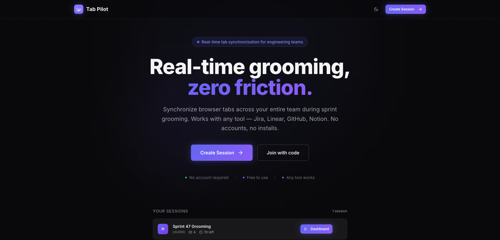
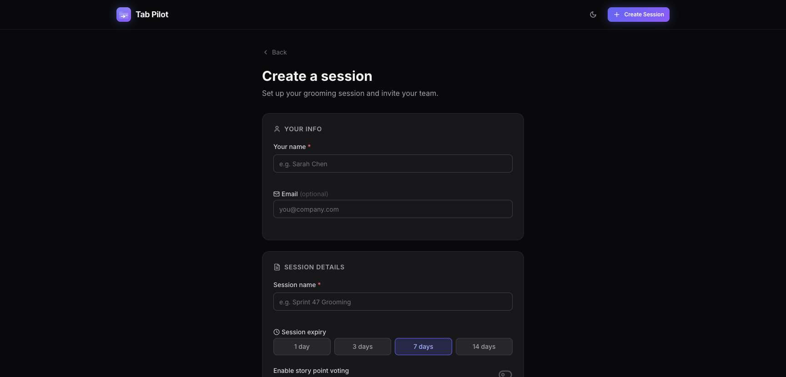
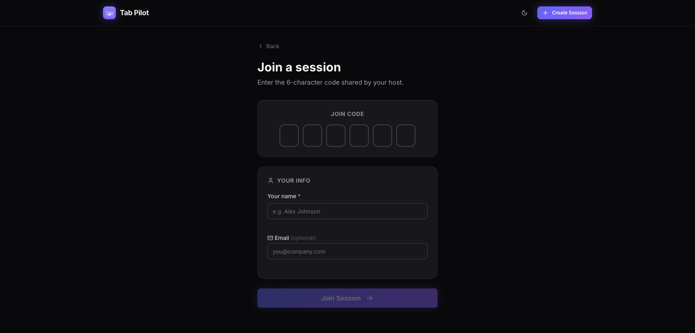
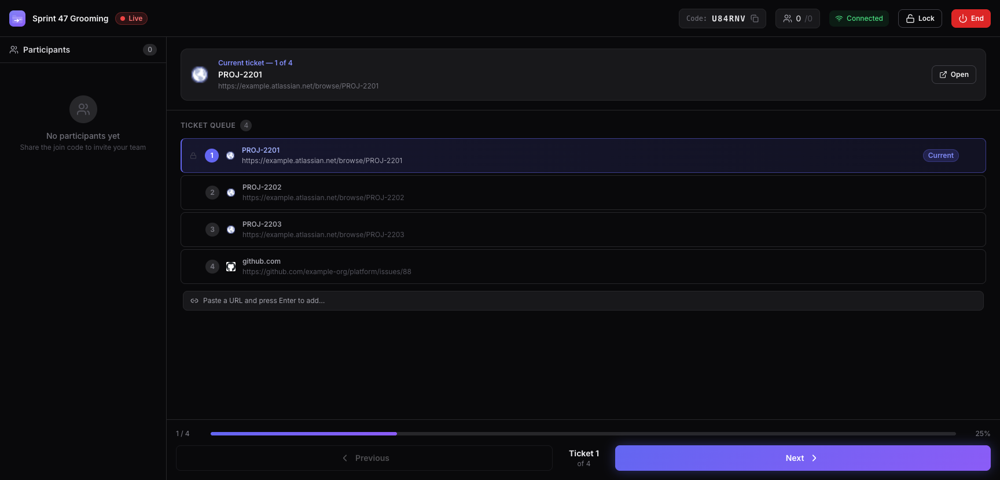
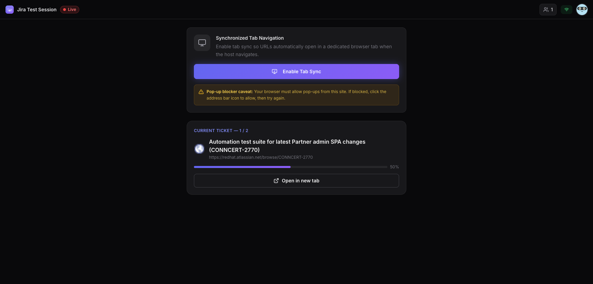

<p align="center">
  
</p>

<h1 align="center">Tab Pilot</h1>

<p align="center">
  <strong>Real-time tab synchronization for engineering grooming sessions</strong><br>
  <em>The host navigates. Everyone follows. No installs, no accounts, no friction.</em>
</p>

<p align="center">
  <a href="https://github.com/gautamkrishnar/TabPilot/actions/workflows/ci.yml"></a>
  <a href="https://www.gnu.org/licenses/gpl-3.0"></a>
  <a href="https://nodejs.org/"></a>
  <a href="https://github.com/gautamkrishnar/TabPilot/pkgs/container/tabpilot"></a>
</p>

<p align="center">
  <a href="https://tabpilot.gkr.pw/"><strong>Try Tab Pilot &rarr;</strong></a>
</p>

## What is Tab Pilot?

Remote grooming sessions waste minutes on "which ticket are we on?". Tab Pilot fixes that.

The facilitator creates a session, pastes a list of ticket URLs, and shares a 6-character join code. When they click **Next**, every participant's browser automatically opens the correct ticket — no copy-pasting links, no confusion, no lag.

It works with any ticketing tool that has a URL: **Jira, Linear, GitHub Issues, Notion, Confluence, Shortcut, ClickUp**, or anything else.

## Features

- 🔗 **Real-time tab sync** — when the host navigates, every participant follows instantly
- 🎟️ **6-character join codes** — share in Slack, Teams, or a meeting chat in seconds
- 👤 **Zero-friction joining** — just a name, no accounts or installs required
- 🌐 **Works with any tool** — any `http/https` URL is supported
- 🔒 **Session locking** — stop new participants from joining mid-session
- 🚫 **Kick participants** — remove someone from an active session
- 🗳️ **Story point voting** — optional estimation with simultaneous reveal
- 🎫 **Live queue management** — add, remove, and reorder tickets during a session
- 🏷️ **Jira title enrichment** — Jira URLs automatically show their issue summary
- 💾 **Session memory** — previously joined sessions appear on the home screen for one-click resume
- 🌓 **Dark / light mode** — system preference by default, with a manual toggle
- 👥 **Co-host support** — invite trusted participants as co-hosts via a secure invite link; co-hosts share navigation control with the primary host
- ✏️ **Edit profile mid-session** — participants and hosts can update their display name and email at any time during a session
- ✅ **Session completion state** — the navigation controls highlight when every ticket has been groomed, with a clear "All tickets groomed!" indicator visible to both hosts and participants
- 📊 **Save votes to Jira** — export story point estimates directly to Jira issues when Jira integration is configured
- 🔄 **Toggle voting mid-session** — hosts can enable or disable story point voting after session creation
- ✨ **AI ticket quality scoring** — Jira tickets are scored on six quality dimensions (clarity, completeness, actionability, testability, formatting, context) using Gemini Flash via Vertex AI — opt-in via service account credentials

## Get Started

### Run with Podman

```bash
# Without docs (default)
podman compose up -d
open http://localhost:3000

# With docs (serves docs at /docs/)
podman build --target runner-with-docs -t tabpilot:latest-docs .
```

Two image variants are published to GHCR: `latest` (default, ~280 MB) and `latest-docs` (~281 MB, bundles the docs site at `/docs/`).

### Run locally (for development)

See **[docs/DEVELOPMENT.md](docs/DEVELOPMENT.md)** for the full setup guide.

## Screenshots

### Home


### Create a session


### Join with a code


### Host dashboard — live session


### Participant view


## Contributing

Bug reports, feature requests, and pull requests are welcome.

- [Report a bug](https://github.com/gautamkrishnar/TabPilot/issues/new?template=bug_report.yml)
- [Request a feature](https://github.com/gautamkrishnar/TabPilot/issues/new?template=feature_request.yml)
- [Browse open issues](https://github.com/gautamkrishnar/TabPilot/issues)
- [Contributing guide](https://github.com/gautamkrishnar/TabPilot/blob/master/.github/CONTRIBUTING.md)
- [Discussions](https://github.com/gautamkrishnar/TabPilot/discussions)

## License

Tab Pilot is released under the [GNU General Public License v3.0](LICENSE).
